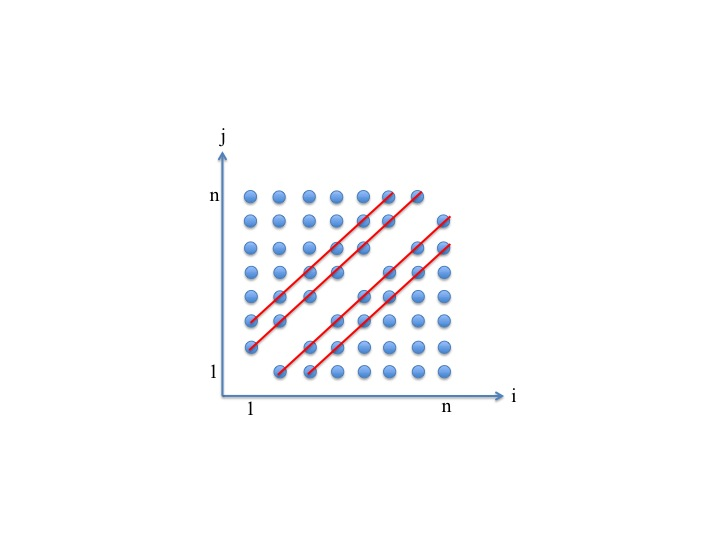

+++
title = 'Lec. 1: Probability models and axioms'
date = 2024-09-19T22:07:08+08:00
draft = false
math = true
+++



## Exercise: Using Countable Additivity

Let the sample space be the set of positive integers and suppose that `$\mathbf{P}(n) = \frac{1}{2^n}$`, for `$n = 1, 2, \ldots$`. Find the probability of the set `$\{3, 6, 9, \ldots\}$`, that is, of the set of positive integers that are multiples of 3.

**Answer:** 0.14286

**Solution:**

Using countable additivity, and with `$\alpha = 2^{-3} = \frac{1}{8}$`, the desired probability is

`$$
\frac{1}{2^3} + \frac{1}{2^6} + \frac{1}{2^9} + \cdots = \alpha + \alpha^2 + \alpha^3 + \cdots = \frac{\alpha}{1 - \alpha} = \frac{\frac{1}{8}}{1 - \left(\frac{1}{8}\right)} = \frac{1}{7}.
$$`

## Exercise: On Countable Additivity

Let the sample space be the two-dimensional plane. For any real number `$x$`, let `$A_x$` be the subset of the plane that consists of all points of the vertical line through the point `$(x, 0)$`, i.e., 

`$$
A_x = \{(x, y) : y \in \mathbb{R}\}.
$$`

a) Do the axioms of probability theory imply that the probability of the union of the sets `$A_x$` (which is the whole plane) is equal to the sum of the probabilities `$\mathbf{P}(A_x)$`?

**Answer:** No

b) Do the axioms of probability theory imply that

`$$
\mathbf{P}(A_1 \cup A_2 \cup \cdots) = \sum_{x=1}^{\infty} \mathbf{P}(A_x)?
$$`

(In other words, we consider only those lines for which the `$x$` coordinate is a positive integer.)

**Answer:** Yes

**Solution:**

**a)** The collection of sets `$A_x$` is not countable because the set of real numbers is not countable (i.e., cannot be arranged in a sequence), and so the additivity axiom does not apply.

**b)** The countable additivity axiom applies because we are dealing with a sequence (in particular, a countable collection) of disjoint events.

## De Morgan's law

Find the value of `$\mathbf{P}(A \cup (B^c \cup C^c)^c)$` for each of the following cases:

1. The events `$A$`, `$B$`, `$C$` are disjoint events and `$\mathbf{P}(A) = \frac{2}{5}$`.

   `$$
   \mathbf{P}(A \cup (B^c \cup C^c)^c) = \text{Answer: } 0.4
   $$`

2. The events `$A$` and `$C$` are disjoint, and `$\mathbf{P}(A) = \frac{1}{2}$` and `$\mathbf{P}(B \cap C) = \frac{1}{4}$`.

   `$$
   \mathbf{P}(A \cup (B^c \cup C^c)^c) = \text{Answer: } 0.75
   $$`

3. `$\mathbf{P}(A^c \cap (B^c \cup C^c)) = 0.7$`.

   `$$
   \mathbf{P}(A \cup (B^c \cup C^c)^c) = \text{Answer: } 0.3
   $$`

**Solution:**

1. Using De Morgan's law, we have `$(B^c \cup C^c)^c = B \cap C = \emptyset$` so that 

   `$$
   \mathbf{P}(A \cup (B^c \cup C^c)^c) = \mathbf{P}(A \cup \emptyset) = \mathbf{P}(A) = \frac{2}{5}.
   $$`

2. Note that `$A$` and `$B \cap C$` are disjoint. Therefore, using De Morgan's law again, together with the additivity axiom for two disjoint events, we have 

   `$$
   \mathbf{P}(A \cup (B^c \cup C^c)^c) = \mathbf{P}(A \cup (B \cap C)) = \mathbf{P}(A) + \mathbf{P}(B \cap C) = \frac{3}{4}.
   $$`

3. De Morgan's law implies that `$(A^c \cap (B^c \cup C^c))^c = A \cup (B^c \cup C^c)^c$`, which is the event of interest. Therefore, 

   `$$
   \mathbf{P}(A \cup (B^c \cup C^c)^c) = 1 - \mathbf{P}(A^c \cap (B^c \cup C^c)) = 1 - 0.7 = 0.3.
   $$`

## Problem 4. Parking Lot Problem

Mary and Tom park their cars in an empty parking lot with `$n \geq 2$` consecutive parking spaces (i.e., `$n$` spaces in a row, where only one car fits in each space). Mary and Tom pick parking spaces at random; of course, they must each choose a different space. (All pairs of distinct parking spaces are equally likely.) What is the probability that there is at most one empty parking space between them?

Your answer should be a function of `$n$`, entered using standard notation (described in Unit 0), also available through the “STANDARD NOTATION” button just above the “Submit” button.

**Answer: `$\frac{4n-6}{n \cdot (n-1)}$`**

**Solution:**

The sample space is `$\Omega = \{(i,j) : i \neq j, 1 \leq i, j \leq n\}$`, where outcome `$(i, j)$` indicates that Mary and Tom parked in slots `$i$` and `$j$`, respectively. We apply the discrete uniform probability law to find the required probability. We are interested in the probability of the event 

`$$
A = \{(i, j) \in \Omega : |i - j| \leq 2\}.
$$`

We first find the cardinality of `$\Omega$`. There are `$n^2$` pairs `$(i, j)$`, but since the set `$\Omega$` excludes outcomes of the form `$(i, i)$`, the cardinality of `$\Omega$` is `$n^2 - n = n \cdot (n - 1)$`.

If `$n \geq 3$`, event `$A$` consists of the four lines indicated in the figure above and contains

`$$
2 \cdot (n - 1) + 2 \cdot (n - 2) = 4n - 6
$$`

elements. If `$n = 2$`, event `$A$` contains exactly 2 elements, namely, `$(1, 2)$` and `$(2, 1)$`, which agrees with the formula `$4 \cdot (2) - 6 = 2$`. Therefore,

`$$
\mathbf{P}(A) = \frac{4n - 6}{n \cdot (n - 1)}.
$$`

