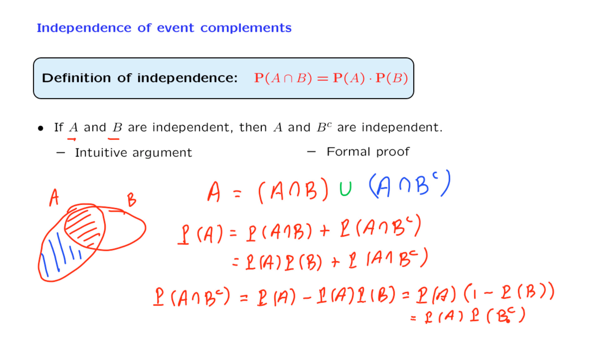

+++
title = 'Lec. 3: Independence'
date = 2024-09-19T22:07:08+08:00
draft = false
math = true
+++



## Exercise: Independence of two events - II

Let `$ A $` be an event, a subset of the sample space `$ \Omega $`. Are `$ A $` and `$ \Omega $` independent?

- [x] Yes, they are independent
- [ ] No, they are dependent

**Answer:** Yes, they are independent.

**Solution:**

Yes, because 

`$$
P(A \cap \Omega) = P(A) = P(A) \cdot 1 = P(A) \cdot P(\Omega).
$$`

Intuitively, `$ P(A) $` represents our beliefs about the likelihood that `$ A $` will occur. If we are told that `$ \Omega $` occurred, this does not give us any new information; we already knew that `$ \Omega $` is certain to occur. For this reason,

`$$
P(A \mid \Omega) = P(A).
$$`

## Exercise: Independence of event complements

Suppose that `$ A $` and `$ B $` are independent events. Are `$ A^c $` and `$ B^c $` independent?

- [x] Yes, they are independent
- [ ] No, they are dependent

**Answer:** Yes, they are independent.

**Solution:**

We saw in the previous segment that for any 2 generic events `$ E_1 $` and `$ E_2 $`, independence of `$ E_1 $` and `$ E_2 $` implies independence of `$ E_1 $` and `$ E_2^c $`. In the case of this particular problem, we can apply this result with `$ E_1 = A $` and `$ E_2 = B $` to conclude that since `$ A $` and `$ B $` are assumed to be independent, then `$ A $` and `$ B^c $` are also independent.

Independence is symmetric, so `$ A $` and `$ B^c $` being independent is the same as `$ B^c $` and `$ A $` being independent. If we now reuse the generic result with `$ E_1 = B^c $` and `$ E_2 = A $`, we can conclude that `$ B^c $` and `$ A^c $` are also independent, which by symmetry is the same as `$ A^c $` and `$ B^c $` being independent.

To summarize: 

`$ A $` and `$ B $` independent `$\implies A $` and `$ B^c $` independent `$\implies B^c $` and `$ A $` independent `$\implies B^c $` and `$ A^c $` independent `$\implies A^c $` and `$ B^c $` independent.
